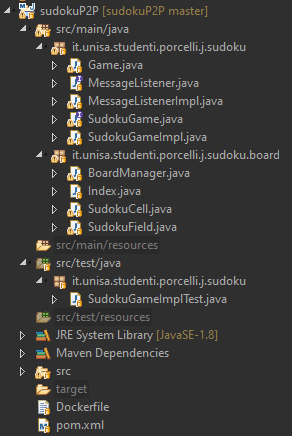
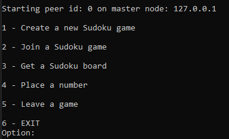
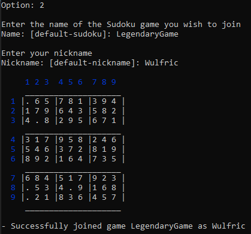

| Sudoku Game | Jacopo Porcelli | Architetture Distribuite per il Cloud | 2020/2021 |
| --- | --- | --- | --- |  

# Sudoku Game

## What it is
**P2P application** that allows the creation of sudoku game boards and it allows player to join and place numbers in a board, scoring or losing points, and also keeping track of the points in a leaderboard. 

## How it was developed
SudokuP2P has been developed in Java. The application uses the [TomP2P](https://tomp2p.net/) library to create and manage a Distributed HashTable (DHT) used to create a peer-to-peer network in which each peer may enter and become able to access resources stored on the DHT. Another key tool in development has been Maven, a project management tool, to easily manage installation and resolve library dependencies.

## Idea
This project has been realized using the [Publisher/Subscriber Example](https://github.com/spagnuolocarmine/p2ppublishsubscribe) as reference. The key features of the designed Sudoku Game are the following: each player/peer may create a new sudoku game board, join an existing sudoku game using a nickname and then start placing numbers in it. Each time a player places a number in a sudoku game board, if the number has been correctly placed the player scores 1 point, if the place was already taken by another number the player scores 0 points and if the number was not correctly placed (following the rules of the sudoku game) the player loses 1 point. Each time a player scores a point, every player that has joined that game will be notified, this also happens when a player completes a sudoku. 


# Solution's Overview

The interface to implement was the following:
```java
public interface SudokuGame {
	/**
	 * Creates new games.
	 * @param _game_name a String, the sudoku game name.
	 * @return bidimensional array containing the grid field of the sudoku game created.
	 */
	public Integer[][] generateNewSudoku(String _game_name);
	
	/**
	 * Joins in a game.
	 * @param _game_name a String, the sudoku game name.
	 * @param _nickname a String, the name of the user.
	 * @return true if the join success, false otherwise.
	 */
	public boolean join(String _game_name, String _nickname);
	/**
	 * Gets the Sudoku matrix game, with only the number placed by the user.
	 * @param _game_name a String, the sudoku game name.
	 * @return the integer matrix of the sudoku game.
	 */
	public Integer[][] getSudoku(String _game_name);
	/**
	 * Places a new solution number in the game.
	 * @param _game_name a String, the sudoku game name.
	 * @param _i the position on the row.
	 * @param _j the position on the column.
	 * @param _number the solution number.
	 * @return the integer score of the placed number.
	 */
	public Integer placeNumber(String _game_name, int _i, int _j, int _number);	
}
```

The developed solution has the following features available for each player(peer):
- *create* a new Sudoku game (board automatically generated);
- choose the *difficulty* of the sudoku created (which changes the amount of missing numbers);
- *join* an already created game;
- *get* a sudoku game to check to updated board;
- *place a number* in a cell of a joined sudoku game;
- *be notified* each time a player scores a point on a joined game;
- *leave* a joined game (stop playing it and receiving notifications);
- check the *leaderboard* for a joined game whenever a player completes it;
- leave the network;
  
#
# Structure

The project's structure is the following:



There are two main packages for the application.

The **sudoku** package contains the main class (Game), the interface (SudokuGame) and its implementation (SudokuGameImpl), the message listener interface (MessageListener) and its implementation (MessageListenerImpl). 

The **board** package contains the classes used to generate a new sudoku board (Index, SudokuCell and SudokuField) and the class to handle every other utility action on a sudoku grid (BoardManager).

All the dependencies are put in the *pom.xml*. These include the TomP2P dependency:

```xml
<repositories>
	<repository>
		<id>tomp2p.net</id>
		<url>http://tomp2p.net/dev/mvn/</url>
	</repository>
</repositories>
	
<dependencies>
	<dependency>
		<groupId>net.tomp2p</groupId>
		<artifactId>tomp2p-all</artifactId>
		<version>5.0-Beta8</version>
	</dependency>
<dependencies>
```
#
## Game & SudokuGameImpl

The main class (Game.java) handles the startup of the application through a series of interactions made via the command line. It outputs on the terminal used to launch the application a menu of choices and then waits for the user's choice.

At startup it creates the instance of the peer (instance of the SudokuGameImpl.java class). 

```java
public SudokuGameImpl( int _id, String _master_peer, final MessageListener _listener) throws Exception {
		bManager = new BoardManager();
		
		peer = new PeerBuilder(Number160.createHash(_id))
						.ports(DEFAULT_MASTER_PORT+_id).start();
		_dht = new PeerBuilderDHT(peer).start();
		
		FutureBootstrap fb = peer.bootstrap()
								.inetAddress(InetAddress.getByName(_master_peer))
								.ports(DEFAULT_MASTER_PORT)
								.start();
		fb.awaitUninterruptibly();
		if(fb.isSuccess()) {
			peer.discover().peerAddress(
								fb.bootstrapTo().iterator().next())
								.start().awaitUninterruptibly();
		} else {
			throw new Exception("Error in master peer bootstrap.");
		}
		
		peer.objectDataReply(new ObjectDataReply() {
			public Object reply(PeerAddress sender, Object request) 
														throws Exception {
				return _listener.parseMessage(request);
			}
		});
	}
```

The constructor of this class initiates the peer and does the bootstrap, making it enter the network as a peer. The constructor takes the peer id, the master peer id and a message listener as input.

Once the peer has been initialized and the menu has been output on the terminal, the user can then choose an action to take.



Every action consists in the invocation of a method on the SudokuGameImpl instance. Based on the action chosen, more inputs are requested to the user.

Here is an example of an interaction with the user (ex. join a game):



And here is an example of the output shown whenever a game joined was completed by one of the peers (showing nickname and score for each player):


---
Various objects are kept on the DHT:
- the sudoku game board itself (Integer[][]);
- a list for the peers that join a certain game (HashSet) used to send direct messages every time a player scores a point;
- a list of the nicknames (ArrayList) used by players;
- a list of the scores (ArrayList) of the players. These last two are used to keep track of the scores and nicknames that will make up the leaderboard.

These objects are put on the DHT using as *key* the SHA1 hash of the string "game_name" (literally the name chosen for that sudoku game) concatenetad with a fixed word that changes based on the object itself (example: string "_players" for the HashSet of peers that joined a certain game).

Every time an object on the DHT needs to be updated, the instructions used follow this pattern (example taken from method *"join"*):

```java
futureGet = _dht.get(Number160.createHash(_game_name + players_game_name)).start();
futureGet.awaitUninterruptibly();
if (futureGet.isSuccess()) {
	if(futureGet.isEmpty()) 
		return false;

	HashSet<PeerAddress> players_peers_of_game;
	players_peers_of_game = (HashSet<PeerAddress>) 
						futureGet.dataMap().values().iterator().next().object();
	
	players_peers_of_game.add(_dht.peer().peerAddress());
	
	_dht.put(Number160.createHash(_game_name + players_game_name))
		.data(new Data(players_peers_of_game)).start().awaitUninterruptibly();
}
```
The core idea is to first get the object on the DHT, then update its state and lastly put it back on the DHT so that every other peer can access its updated state.

## MessageListener

This class needs to implement the method "parseMessage", which will be invoked whenever the peer receives a new message sent directly by other peers. 

```java
public Object parseMessage(Object obj) {
		
	TextIO textIO = TextIoFactory.getTextIO();
	TextTerminal terminal = textIO.getTextTerminal();
	terminal.printf("\n["+peerid+"] Sudoku name: "+obj+"\n\n");
	return "success";
}
```

Its behaviour is very basic, it just needs to output on the terminal the received message, which will be prepared by the sender. This message may include information related to the sending peer scoring a point or completing a sudoku, the latter makes the peer build a message so that it also contains the leaderboard of all the players that joined that sudoku game.

#
# Testing: Unit Test with JUnit

The testing has been done through the usage of **JUnit**, and is done every time the project is built using Maven (plugin surefire). Here are the dependency and the plugin as they are in the *pom.xml*.

```xml
<dependencies>
	<dependency>
		<groupId>org.junit.jupiter</groupId>
    	<artifactId>junit-jupiter-engine</artifactId>
    	<version>5.5.2</version>
	</dependency>
</dependencies>

<plugins>
	<plugin>
        <groupId>org.apache.maven.plugins</groupId>
        <artifactId>maven-surefire-plugin</artifactId>
        <version>2.22.1</version>
    </plugin>
</plugins>
```

The Test Case class is "SudokuGameImplTest", in which every method of the interface "SudokuGame" implemented is tested.
Each method used for testing requires a JUnit annotation (@Test).
There are also other annotations used, such as @BeforeAll, @AfterEach and @AfterAll.

During the testing, the first method executed is *setup*, which has the @BeforeAll annotation, and is used to prepare the peers for the testing.

```java
@BeforeAll
static void setup() throws Exception {

	p0 = new SudokuGameImpl(0, "127.0.0.1", new MessageListenerImpl(0));
	p1 = new SudokuGameImpl(1, "127.0.0.1", new MessageListenerImpl(1));
	p2 = new SudokuGameImpl(2, "127.0.0.1", new MessageListenerImpl(2));
	p3 = new SudokuGameImpl(3, "127.0.0.1", new MessageListenerImpl(3));
	
	bManager = new BoardManager();
}
```

After the setup the test methods are executed. Each of them has a series of *asserts* to verify the correct behaviour of the tested method.

Here is an example for the *join* method:

```java
@Test
void testJoin() {
	// Join in a game not created.
	assertFalse(p0.join("joinGame1", "nickname0"), "joined a game not created yet");
		
	p0.generateNewSudoku("joinGame1");
	assertTrue(p0.join("joinGame1", "nickname0"), "game not joined as intended");
		
	// Join with a nickname already used.
	assertFalse(p1.join("joinGame1", "nickname0"), "joined a game with an already used nickname");
	assertTrue(p1.join("joinGame1", "nickname1"), "game not joined as intended with an unused nickname");
		
	assertTrue(p0.getGamesJoined().contains("joinGame1"), "p0 correctly joined the game");
	assertTrue(p1.getGamesJoined().contains("joinGame1"), "p1 correctly joined the game");
}
```

There is a method with the @AfterEach annotation, to clear the joined games list for each peer. So that every test method can be executed with reset peers.

```java
@AfterEach
void leaveAll() {
    leaveGames(p0);
    leaveGames(p1);
    leaveGames(p2);
    leaveGames(p3);
}

public void leaveGames(SudokuGameImpl peer) {
	ArrayList<String> games = new ArrayList<String>();
	peer.getGamesJoined();
	for(String game : games) {
		peer.leaveGame(game);
	}
}
```

After every test has been executed, every peer will leave the network.

```java
@AfterAll
static void leaveNetwork() {
	assertTrue(p0.leaveNetwork(), "p0 didn't leave the network");
	assertTrue(p1.leaveNetwork(), "p0 didn't leave the network");
	assertTrue(p2.leaveNetwork(), "p0 didn't leave the network");
	assertTrue(p3.leaveNetwork(), "p0 didn't leave the network");
		
	assertEquals(0, p0.getGamesJoined().size(), "p0 still has some games joined");
	assertEquals(0, p1.getGamesJoined().size(), "p1 still has some games joined");
	assertEquals(0, p2.getGamesJoined().size(), "p2 still has some games joined");
	assertEquals(0, p3.getGamesJoined().size(), "p3 still has some games joined");
}
```

#
# Execution in a Docker Container

This application can be easily executed in a Docker container.
The project has a Dockerfile in it, which can be used to launch the container.

Here is the Dockerfile content:

```dockerfile
FROM alpine/git
WORKDIR /app
RUN git clone https://github.com/jackcaj97/jacopo_porcelli_adc_2020.git

FROM maven:3.5-jdk-8-alpine
WORKDIR /app
COPY --from=0 /app/jacopo_porcelli_adc_2020/sudokuP2P /app
RUN mvn package

FROM openjdk:8-jre-alpine
WORKDIR /app
ENV MASTERIP=127.0.0.1
ENV ID=0
COPY --from=1 /app/target/sudokuP2P-1.0-jar-with-dependencies.jar /app

CMD /usr/bin/java -jar sudokuP2P-1.0-jar-with-dependencies.jar -m $MASTERIP -id $ID
```

The steps to execute this application in a Docker container are the following:
- Download/clone the repository (https://github.com/jackcaj97/jacopo_porcelli_adc_2020)
- Open a terminal and move to the directory containing the Dockerfile downloaded.
- **Build the container** using the following instruction:
```
docker build --no-cache -t p2p-sudoku-client .
```
- **Start the Master Peer** with the following instruction:
```
docker run -i --name MASTER-PEER -e MASTERIP="127.0.0.1" -e ID=0 p2p-sudoku-client
```
The parameters added with the *run* instruction are:

**--name**: Name of the container;

**-e**: Environment variables, *MASTERIP* is the environment variable for the IP address of the master peer and *ID* is the one for the peer's identifier in the network (e.g. master peer's id is 0);

- **Start a Generic Peer**:
  - Before starting another peer for the network, since the master peer is being executed on a docker container, we need to check the IP address associated to the master peer via the following instructions:
    - Check the container id in the list of containers:
	  ```
	  docker ps
	  ```
	- Check the IP address of MASTER-PEER:
	  ```
	  docker inspect <container ID>
	  ```
  - Now that we know the IP address of the MASTER-PEER we can start a new generic peer with the following instruction:
```
docker run -i --name PEER-1 -e MASTERIP="172.17.0.2" -e ID=1 p2p-sudoku-client
```
Remember to put the IP address of the container MASTER-PEER in *MASTERIP* and use unique identifiers for *ID*.

#
# Conclusions and Future Developments

As stated while studying P2P networks, they can be used for a variety of applications, although they're commonly known as "File-Sharing" systems.

During development I've managed to refine my knowledge of P2P networks behaviour and the practical application of studied concepts.

The future developments possible are many. For example the application of the difficulty could be improved by being less random and more aimed. The look of the application right now is very basic and raw, so it could be improved in future versions of the application.